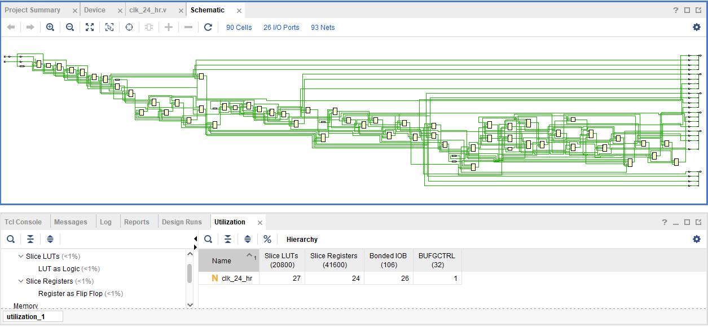
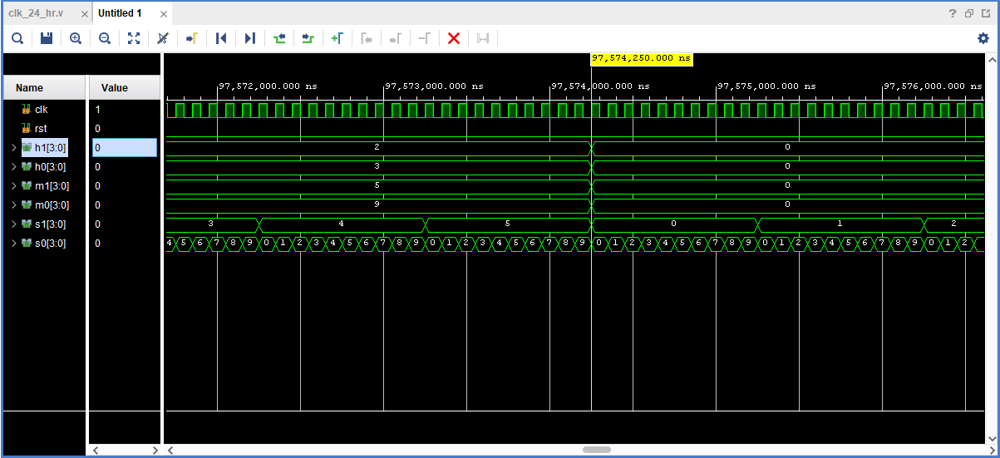
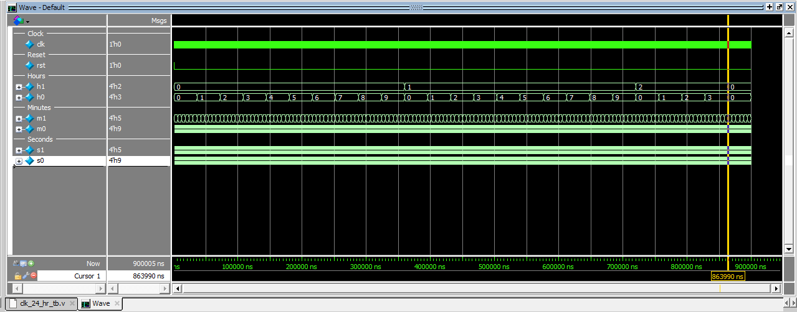

# 24-Hour Digital Clock Using Verilog HDL

## Overview

This project presents the design and simulation of a 24-hour digital clock using Verilog HDL. The system is designed using sequential digital logic to display hours, minutes, and seconds in real time. Separate counters are implemented for seconds, minutes, and hours along with rollover conditions to maintain accurate time progression in 24-hour format.

The design is modeled using Register Transfer Level (RTL) methodology and verified through simulation using Vivado and ModelSim.

---

## Features

- 24-hour clock format
- Seconds, minutes, and hours counters
- Sequential RTL design
- Rollover logic implementation
- Reset functionality
- Vivado RTL schematic generation
- Simulation and verification using Vivado and ModelSim

---

## Technologies Used

- Verilog HDL
- Vivado
- ModelSim

---

## Project Files

- `clk_24_hr.v` – Main Verilog HDL design file
- `clk_24_hr_tb.v` – Testbench for simulation and verification
- `Digital_Clock.pdf` – Project documentation report
- `dig_clk.png` – RTL schematic output
- `dig_clk1_sim.png` – Vivado simulation waveform
- `dig_clk_Modelsim.png` – ModelSim simulation waveform

---

## RTL Schematic

---

## Vivado Simulation Output

---

## ModelSim Simulation Output

---

## Verification

The functionality of the digital clock was verified using a dedicated Verilog testbench in Vivado and ModelSim simulation environments. The simulation waveforms confirm correct operation of seconds, minutes, and hours counters along with proper rollover behavior and reset functionality.

---

## Future Scope

- FPGA implementation
- Seven-segment display interfacing
- Alarm and timer functionality
- Stopwatch feature
- Modular RTL optimization
- FSM-based control architecture

---

## Author

Priya Nageswari Karanam
